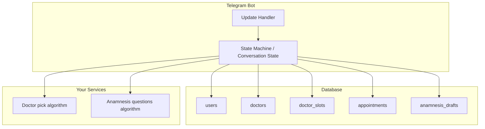

# План: Telegram-бот АСМС и база данных

## Безопасность токена

**Токен бота не должен попадать в репозиторий.** Хранить его в переменной окружения, например в файле `.env` (уже в [.gitignore](.gitignore)). В коде читать через `os.getenv("BOT_TOKEN")`. В плане и в коде использовать плейсхолдер; реальный токен держать только в `.env` на машине разработки/сервера.

---

## Спецификация сценариев бота (сводка)

- **Старт:** есть записи в БД → выбор «Первичный» / «Вторичный» (+ пояснение: вторичный = визиты к тому же врачу за последние 6 мес). Нет записей → сразу первичный приём.
- **Вторичный приём:** выбор врача из списка (к кому обращался за 6 мес) → слоты 10 мин: приоритет — все окна за 3 дня; если за 3 дня меньше 10 окон — показывать ближайшие 10 слотов.
- **Первичный, знает врача:** предложить умный анамнез (текст про плюсы). Без анамнеза → слоты 20 мин (3 дня или 10 окон). С анамнезом → описание симптомов → 10–20 нумерованных вопросов по одному сообщению, черновик сохранять, при возврате — «Продолжить?» → сводка + «Всё верно» / указать номер вопроса и переввести ответ → слоты 10 мин. При записи в таблицу записей добавлять поле description (текст умного анамнеза, если был).
- **Первичный, не знает врача:** подробное описание симптомов → алгоритм возвращает до 3 врачей (или терапевт) с кратким описанием → после выбора врача тот же блок про умный анамнез и слоты.
- **После записи:** подтверждение пользователю; напоминание за 24 ч с возможностью отменить. Запись в БД: пациент (tg id), врач, слот, description при наличии анамнеза.

Данные по врачам, симптомам, подбору врачей и вопросам анамнеза — ваши; бот только оболочка (ввод, нумерация, сводка, исправление по номеру, черновик).

---

## Архитектура и потоки данных

---

## Схема базы данных

Рекомендуемый вариант: **SQLite** для беты (один файл, без поднятия сервера БД). При необходимости позже можно заменить на PostgreSQL через слой абстракции (SQLAlchemy или аналог).

### Таблицы

**1. `users`** — пользователи Telegram (для связки записей и черновиков).

| Поле        | Тип            | Описание                   |
| ----------- | -------------- | -------------------------- |
| id          | INTEGER PK     | Автоинкремент              |
| telegram_id | INTEGER UNIQUE | ID пользователя в Telegram |
| created_at  | DATETIME       | Первое обращение к боту    |

**2. `doctors`** — справочник врачей (данные генерируете вы; бот только читает).

| Поле        | Тип        | Описание                                 |
| ----------- | ---------- | ---------------------------------------- |
| id          | INTEGER PK |                                          |
| full_name   | TEXT       | Например "Тихомирова А.А."               |
| specialty   | TEXT       | Например "Отоларинголог"                 |
| description | TEXT       | Краткое описание для подбора (что лечит) |

**3. `doctor_slots`** — занятость/расписание врачей (окна по 10 или 20 минут).

| Поле             | Тип                     | Описание                                          |
| ---------------- | ----------------------- | ------------------------------------------------- |
| id               | INTEGER PK              |                                                   |
| doctor_id        | INTEGER FK → doctors.id |                                                   |
| start_utc        | DATETIME                | Начало слота (UTC или фиксированный часовой пояс) |
| duration_minutes | INTEGER                 | 10 или 20                                         |
| is_booked        | BOOLEAN                 | Занят ли слот (при записи ставить True)           |

Уникальность: пара `(doctor_id, start_utc)` чтобы не дублировать слоты. Для «ближайшие 10 окон» / «3 дня» — выборка по `doctor_id`, `start_utc >= now`, `is_booked = False`, сортировка по `start_utc`, лимит или фильтр по дате.

**4. `appointments`** — история и будущие записи (то, что нужно для «был ли у врача» и напоминаний).

| Поле          | Тип                          | Описание                        |
| ------------- | ---------------------------- | ------------------------------- |
| id            | INTEGER PK                   |                                 |
| user_id       | INTEGER FK → users.id        |                                 |
| doctor_id     | INTEGER FK → doctors.id      |                                 |
| slot_id       | INTEGER FK → doctor_slots.id |                                 |
| description   | TEXT NULL                    | Текст умного анамнеза, если был |
| created_at    | DATETIME                     | Время создания записи           |
| reminder_sent | BOOLEAN                      | Напоминание за 24 ч отправлено  |
| cancelled     | BOOLEAN                      | Отменена ли запись              |

По `appointments` (с учётом `cancelled = False` и `slot_id` → `doctor_slots.start_utc`) определяем: к каким врачам пользователь ходил и за последние 6 месяцев — для кнопки «Вторичный приём» и списка врачей.

**5. `anamnesis_drafts`** — черновики умного анамнеза («продолжить с того же места»).

| Поле                   | Тип                          | Описание                                 |
| ---------------------- | ---------------------------- | ---------------------------------------- |
| id                     | INTEGER PK                   |                                          |
| user_id                | INTEGER FK → users.id        |                                          |
| doctor_id              | INTEGER FK → doctors.id NULL | Если врач уже выбран                     |
| symptom_description    | TEXT NULL                    | Исходное описание симптомов              |
| current_question_index | INTEGER                      | Номер текущего вопроса (0-based)         |
| answers_json           | TEXT                         | JSON: список ответов по порядку вопросов |
| updated_at             | DATETIME                     | Для «продолжить» при следующем заходе    |

При старте сценария «с анамнезом» проверять наличие черновика для этого user (и при необходимости doctor_id); если есть — предложить «Продолжить?». После успешной записи черновик удалить или пометить как использованный.

---

## Генерация тестовых данных

Отдельный скрипт (например `scripts/seed_db.py` или `generate_data.py` в корне), который:

1. **Создаёт таблицы** — через миграции или один скрипт инициализации (CREATE TABLE IF NOT EXISTS).
2. **Заполняет `doctors`** — 10–20 записей с разными специальностями (в т.ч. терапевт), `full_name`, `specialty`, `description`.
3. **Генерирует `doctor_slots`** — на ближайшие 7–14 дней для каждого врача слоты по 10 и 20 минут (например каждый час разбивать на 10/20 мин окна), часть слотов уже `is_booked = True` для реалистичности.
4. **Опционально заполняет `appointments`** — несколько записей для тестовых `users` (созданных по `telegram_id` при первом запуске бота или заранее в seed), чтобы проверять сценарий «есть записи» и «вторичный приём за 6 мес».

Параметры (количество врачей, диапазон дат, доля занятых слотов) вынести в константы или аргументы скрипта.

---

## Структура проекта (рекомендуемая)

- Корень: существующие файлы ([data.py](data.py), [query.json](query.json), [README.md](README.md) и т.д.).
- `bot/` — код бота: точка входа, обработчики команд/кнопок, FSM (например `aiogram` или `python-telegram-bot`).
- `bot/states.py` или `bot/conversation.py` — состояния диалога (выбор типа приёма, выбор врача, анамнез по вопросам, подтверждение, выбор слота и т.д.).
- `db/` — работа с БД: подключение, модели/таблицы, запросы (врачи, слоты, записи, черновики). Инициализация схемы при первом запуске или отдельной командой.
- `scripts/` или корень — скрипт генерации данных (`seed_db.py` / `generate_data.py`), вызываемый вручную после инициализации БД.
- `.env.example` — пример с `BOT_TOKEN=` (без значения), чтобы было понятно, что подставлять в `.env`.

---

## Ключевые моменты реализации

- **Выбор слотов:** запрос к `doctor_slots`: сначала слоты за 3 дня (по календарю от текущего момента), если их меньше 10 — запрос «ближайшие 10» без ограничения по 3 дням. Длительность слота: 20 мин для первичного без анамнеза, 10 мин для вторичного и первичного с анамнезом.
- **Вторичный приём — список врачей:** выборка из `appointments` по `user_id`, где `slot_id` → `doctor_slots.start_utc` в пределах последних 6 месяцев, уникальные `doctor_id`, join с `doctors` для вывода ФИО и специальности.
- **Напоминание за 24 ч:** фоновый планировщик (например `APScheduler`) или cron: раз в N минут искать в `appointments` записи с `reminder_sent = False` и `start_utc` через 24 ч, отправлять сообщение в Telegram, ставить `reminder_sent = True`. В сообщении — кнопка «Отменить запись» (по нажатию — `cancelled = True` и при необходимости освободить слот `is_booked = False`).
- **Интеграция с вашими алгоритмами:** подбор врачей по тексту симптомов и получение списка вопросов анамнеза — вызов вашего API или локального модуля; бот передаёт текст, получает список врачей (до 3) или список вопросов; при отсутствии врачей подставлять терапевта из `doctors` по специальности.

---

## Порядок работ (кратко)

1. Настроить окружение: зависимость для ТГ (aiogram или python-telegram-bot), БД (sqlite3 в стандартной библиотеке или SQLAlchemy). Добавить `.env.example` с `BOT_TOKEN=`, в коде читать токен из окружения.
2. Реализовать схему БД и слой доступа: создание таблиц, CRUD для users, doctors, doctor_slots, appointments, anamnesis_drafts.
3. Скрипт генерации данных: врачи, слоты на 7–14 дней, при желании тестовые записи.
4. Бот: команда /start, FSM, сценарии (первичный/вторичный, выбор врача, умный анамнез с нумерацией и исправлением по номеру, выбор слота, подтверждение записи и запись в `appointments` с `description`).
5. Черновики анамнеза: сохранение в `anamnesis_drafts`, при возврате — предложение продолжить.
6. Напоминание за 24 ч и отмена записи.

После подтверждения плана можно переходить к реализации по шагам; токен хранить только в `.env`.